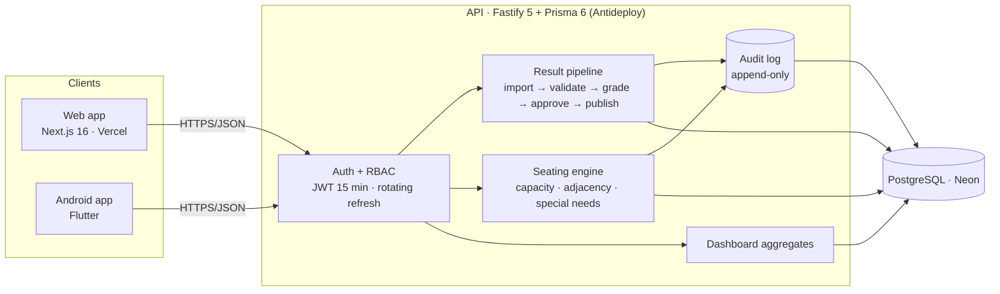
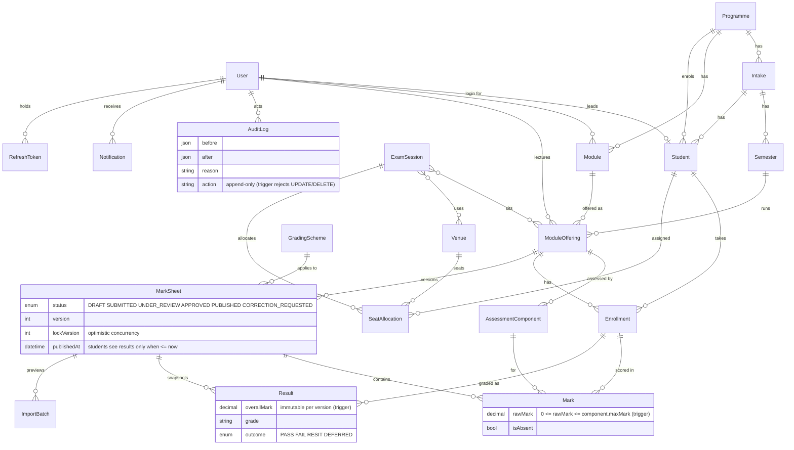
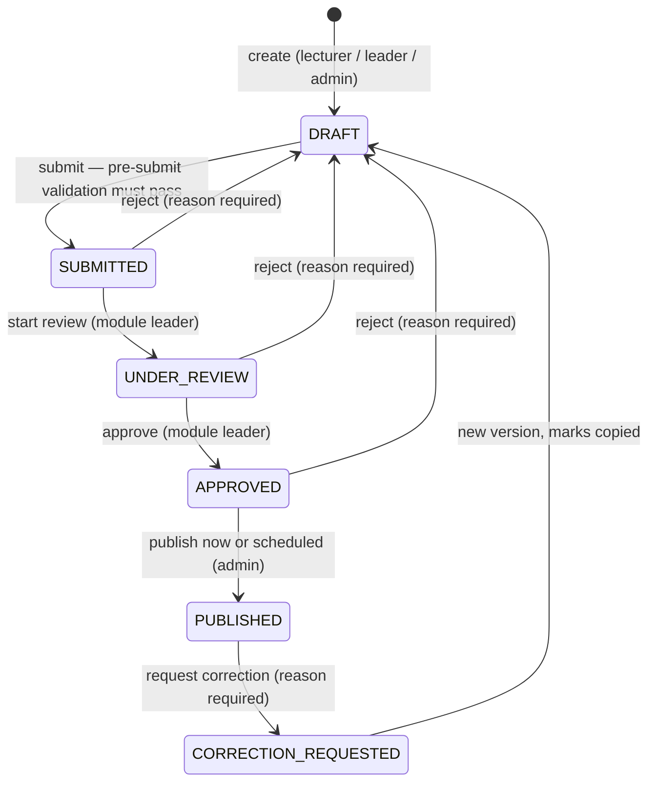

# Architecture

## System overview



Both clients speak the same JSON API. Nothing is decided in the client: role checks, ownership filters, state transitions and validation all live in the API, and the database enforces the invariants that matter most with constraints and triggers.

## Entity–relationship diagram



### Database-level rules (not just UI checks)

| Rule | Mechanism |
|---|---|
| One mark per (sheet, enrolment, component); one seat per (session, student) and per (session, venue, row, col) | unique constraints |
| `0 ≤ rawMark ≤ component.maxMark`, weights 0–100, attempts 1–3, positive grids | `CHECK` constraints + `enforce_mark_max` trigger |
| Marks on a **PUBLISHED** sheet cannot be updated or deleted | `mark_published_immutable` trigger — a correction is a new version |
| `Result` rows are immutable; `AuditLog` is append-only | `result_immutable`, `audit_log_append_only` triggers |
| Students/enrolments are never hard-deleted | `deletedAt` soft delete |

## Result pipeline



Every transition runs the same sequence inside one transaction:

1. **Role check** — `assertTransition(status, action, role, reason)` (pure, unit-tested) plus a scope check (lecturers only their offerings, leaders only their modules).
2. **Optimistic lock** — `UPDATE … WHERE id = ? AND lockVersion = ?`; zero rows updated → `409` with the current lock version.
3. **Results snapshot** — on submit/approve the grade calculator runs for every enrolment and replaces the `Result` rows for this version.
4. **Audit entry** — actor, action, before → after, reason, IP.
5. **Notification** — leader on submit, admin on approve, lecturer on reject/correction, every enrolled student on publish (or "updated" for a correction version).
6. **Standing refresh** — on publish, each student's standing is recomputed from their latest published outcomes.

### Request flow: publish

```mermaid
sequenceDiagram
  participant Admin as RTE admin (web)
  participant API
  participant DB
  participant Student as Student (phone)
  Admin->>API: POST /api/marksheets/:id/transition {action: publish, lockVersion, scheduledPublishAt?}
  API->>API: authenticate → role ADMIN → assertTransition(APPROVED → PUBLISHED)
  API->>DB: BEGIN; UPDATE MarkSheet SET status=PUBLISHED, publishedAt=… WHERE id AND lockVersion
  DB-->>API: 1 row (else 409)
  API->>DB: INSERT AuditLog(before {APPROVED}, after {PUBLISHED})
  API->>DB: INSERT Notification × enrolled students
  API->>DB: UPDATE Student.standing … ; COMMIT
  API-->>Admin: {status: PUBLISHED, lockVersion: n+1}
  Student->>API: GET /api/students/me (results WHERE sheet.status = PUBLISHED AND publishedAt <= now)
  API-->>Student: profile with the new result
```

Ownership is filtered **in the query** (`results: { where: { markSheet: { status: 'PUBLISHED', publishedAt: { lte: now } } } }`), never in the client, so a student can never see an unpublished or embargoed mark by tampering with the app.

### Grade calculation

`overall = Σ (rawMark / maxMark × weight)`; component minimums apply if configured; a passed resit is capped at the scheme's `resitCap`; attempt 3 failing → `FAIL`, earlier attempts → `RESIT`; absent from everything → `DEFERRED`. The scheme (pass mark 40, resit cap 40, A ≥ 70 …) is stored in `GradingScheme` and **labelled as an assumption** until the RTE mentor confirms it. The function is pure and has fixture tests in `backend/src/lib/grading.test.ts`.

### Import

Upload → parsed **server-side** with SheetJS → rows matched to enrolments by student ID and to components by (case- and punctuation-insensitive) header → per-row status `ok / warning / error` with a plain-English message → stored as an `ImportBatch` in `PREVIEW` → commit writes only rows without errors, replacing DRAFT marks. Re-import is idempotent: committing the same file twice changes nothing.

### Statistical flags (explainable, non-blocking)

Component level: σ < 3 across ≥ 5 marks ("suspiciously uniform"), ≥ 30 % of the cohort on one identical mark, mean shifted > 15 points versus the previous published offering of the same module. Row level: a component > 40 points from the student's other components, or an overall > 25 points from the student's published average. Flags are computed on read, shown in the review screen with the reason, and never change a mark or block a transition.

## Seating engine

Pure function `generateSeating(venues, students, seed)` in `backend/src/lib/seating.ts`:

1. **Partition** students across venues, largest venue first, keeping the module mix proportional and capping each module at the venue's non-adjacent maximum (`ceil(capacity / 2)`) when other venues still have room. Capacity always wins: nobody is left unseated to satisfy adjacency.
2. **Fill** each venue row-major. Special-needs students go first into front-row and aisle seats. For every seat the engine picks the module with the most remaining students that does **not** clash with the left neighbour (and the seat in front, in `ROW_AND_COLUMN` venues); when no module fits and spare seats exist it leaves a gap instead.
3. **Repair**: any remaining clash is moved into an empty non-clashing seat, or swapped with a student of another module, for up to four passes.
4. **Report**: allocations, an explicit `unseated` list, a list of remaining violations, and per-venue usage. Same seed ⇒ identical result.

Outputs: colour-coded grid (web), per-venue seating sheet + door list PDF (pdfkit), student lookup by ID (web and phone).

## Security

- Bearer JWT (15 min) + opaque rotating refresh tokens stored hashed; reuse of a rotated token revokes the whole family.
- bcrypt password hashing; login rate limit per IP; lockout for 15 minutes after 5 failed attempts; no account enumeration.
- Deny-by-default: every `/api` route requires a token; each route names the roles it allows via a single permission matrix (`plugins/auth.ts`, unit-tested).
- Zod validation on every input; spreadsheets parsed server-side only, 5 MB limit, extension check.
- Helmet security headers, restricted CORS, pino logs with authorization/password redaction, no PII in logs.
- Seed data is fictional.

## Key trade-offs

| Decision | Why | Cost |
|---|---|---|
| Results recomputed and snapshotted per sheet version rather than stored once | Corrections must never rewrite history; the audit trail and the student's "result updated" notice depend on it | Slightly more rows |
| Immutability enforced by DB triggers as well as the API | "Can a lecturer change a published mark?" must be answerable with *no*, even with direct DB access | Triggers live in raw SQL inside the migration |
| Flags are heuristics, not ML | Explainable to an exam board, no training data, no false authority | Will miss subtle anomalies |
| Seating prefers seating everyone over perfect separation | An exam with an unseated student is a bigger failure than one adjacency clash | Clashes are reported, not eliminated, when a module is larger than half a venue |
| Standing rule is simple (any fail / two resits → review) | Configurable later; today it feeds the at-risk tile honestly | Not the real progression regulations |
| Bearer tokens in web `localStorage` | Cross-origin API (Vercel ↔ Antideploy) without cookie/CSRF complexity in 24 h | XSS would expose tokens; mitigated by short access-token life and refresh rotation |
